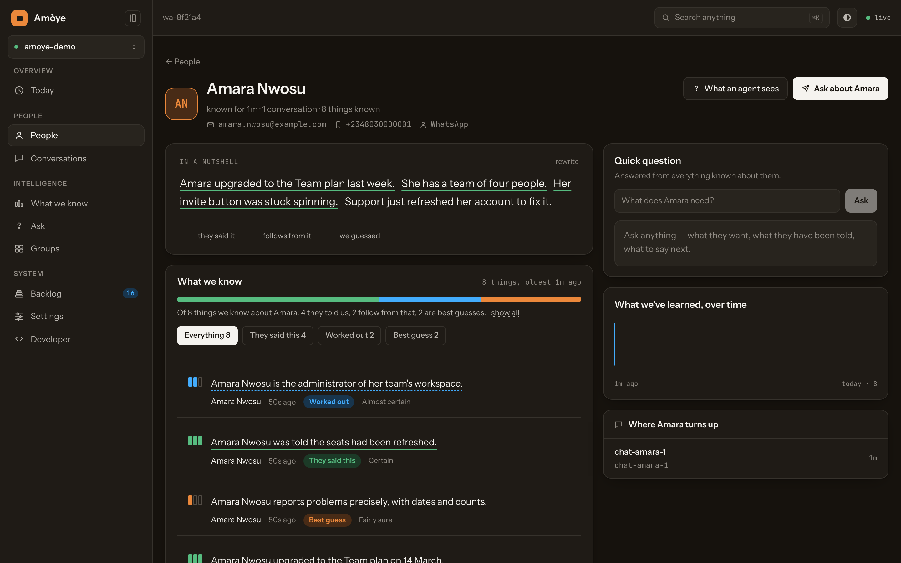
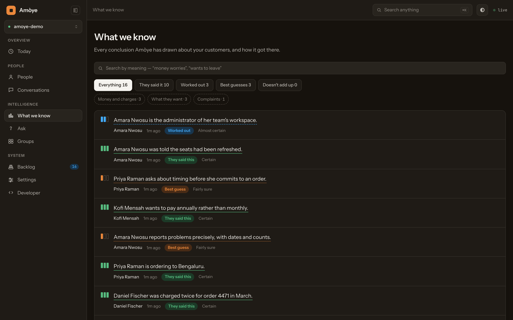

# Amòye

A console for [Honcho](https://github.com/plastic-labs/honcho) — the memory service that
builds a picture of each person your agent talks to.

Honcho is an API. Everything it learns is real, and none of it is visible without writing
code. Amòye is the window: who your agent has met, what it believes about them, how it came
to believe it, and what it would say next.



## What it shows you

Honcho does not just store what was said. It separates what a person **told you** from what
**follows from that** from what is a **best guess**, and Amòye keeps that distinction on
screen — a solid underline, a dashed one, a dotted one. You can always see which is which,
so nobody mistakes an inference for a fact.

| Screen | What it answers |
|---|---|
| **Today** | What changed since yesterday, and what needs attention |
| **People** | Everyone the agent has met, how much is known, how active they are |
| **Person** | One person in full: a plain-English summary, every claim, where it came from |
| **Conversations** | The transcripts, with what was learned from each |
| **What we know** | Every conclusion in the workspace, searchable by meaning |
| **Ask** | A question in plain English, answered from everything known |
| **Groups** | Named sets of conversations, for cohorts and campaigns |
| **Backlog** | What the deriver is still working through |



## Not only for support

It is written to suit any agent that remembers people — a companion, a tutor, a CRM, a
community bot. The vocabulary is configurable in Settings: *people* can read as *students*,
*members* or *customers*, and *conversations* as *sessions* or *threads*. Peer ids stay
opaque and stable; the readable name comes from peer metadata, so nothing is renamed
underneath you.

## Getting started

```bash
npm install
cp .env.example .env.local     # point VITE_API_BASE at your Honcho
npm run dev
```

You need a Honcho instance. Either run [the official
image](https://github.com/plastic-labs/honcho) yourself or use the hosted service.

### Connecting to Honcho

Two ways, and the first is strongly preferred:

**Behind a reverse proxy (recommended).** Point `VITE_API_BASE` at a path your proxy serves,
and have the proxy attach the API token server-side. The browser never holds a key, so a
stolen browser session cannot be replayed against your Honcho from anywhere else. A Caddy
example:

```caddy
handle_path /dashboard-api/* {
	basic_auth {
		import /etc/caddy/console-users.conf
	}
	reverse_proxy 127.0.0.1:8000 {
		header_up Authorization "Bearer YOUR_HONCHO_TOKEN"
	}
}
```

**Direct.** Set `VITE_API_BASE` to your Honcho's URL. The console asks for an API key and
keeps it in that browser only. Fine for local work; think twice on a shared machine.

Scope the key to one workspace. Honcho will mint one for you:

```bash
curl -X POST "$HONCHO/v3/keys?workspace_id=my-workspace" -H "Authorization: Bearer $ADMIN_KEY"
```

### Building

```bash
npm run build          # → dist/, static files, serve them anywhere
npm run lint
```

`VITE_BASE_PATH` sets the path the app is served from — `/` for a domain root, `/console/`
for a subdirectory.

## Screenshots of your own

```bash
BASE_URL=http://localhost:5173 node ops/shot.mjs /dashboard/people /dashboard/knowledge
```

The images in this README come from a workspace of invented people. Anything you capture
from a live workspace has real people in it — check before you publish it.

## ops/learn-identity.py

Optional, and it solves one specific problem. When people reach you through a messaging app,
the contact record your CRM creates carries their self-chosen display name and often no
email. What they said in the conversation is better — but only when they were talking about
*themselves*. Someone asking "is Mrs X on your staff?" is not Mrs X.

The script asks Honcho what each person stated about themselves, accepts only first-person,
high-confidence answers, and writes `learnedName` / `learnedEmail` into peer metadata without
touching the CRM fields. The console then shows the better name with the original behind it.

```bash
HONCHO_API_KEY=… HONCHO_BASE_URL=https://honcho.example.com \
HONCHO_WORKSPACE=my-workspace python3 ops/learn-identity.py --dry-run
```

Standard library only. Run it from cron or a systemd timer. Start with `--dry-run`.

## A note on the third level

"Best guess" claims come from Honcho's *dream* cycle, which only runs once a person passes
`DREAM.DOCUMENT_THRESHOLD` conclusions and has been idle for a while. Two things to know:
the threshold is counted per observer-and-observed pair, and Honcho stores each fact twice
(once as the agent saw it, once as the person saw it), so the effective threshold is roughly
double what you set. If those levels never appear, that is usually why, not a bug.

## Built with

React 19, Vite, Tailwind v4, TypeScript. No component library — the interface is drawn from
a small set of primitives in `src/design/`, so it has one voice rather than a framework's.

## Tests

```bash
npm test
```

Covers the parts where being wrong is quiet rather than loud: which name wins,
how a summary sentence is attributed to a claim, and the deduplication that
keeps one fact from being counted twice.

## Licence

MIT — see [LICENSE](LICENSE). Honcho itself is AGPL-3.0; this is a separate
client that talks to it over HTTP, so that licence does not reach this code.
If you modify Honcho, its terms apply to your copy of Honcho.
